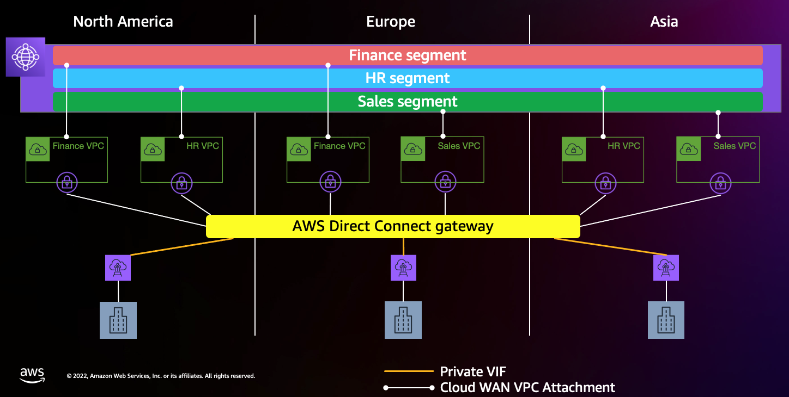

## AWS Cloud WAN and VPC IPAM integration for end-to-end automated routing

AWS Cloud WAN is a service that you can use to build, manage, and monitor a unified global network that connects resources running across your cloud and on-premises environments. Cloud WAN ensures dynamic route propagation across multiple regions, and you only need to update the routing tables of the VPCs to provide network connectivity for workloads that reside within the VPCs.

In this example, we'll see how to automatically push routes to VPC routing tables, and create a fully automated end-to-end routing architecture.

### Scenario and network topology
You have a global network, across 3 regions. Cloud WAN provides global network orchestration across these regions, and there are 3 Cloud WAN segments, one each for departments named Finance, Sales and HR. VPC IPAM stores the CIDRs assigned to each of the 3 departments. 

Whenever a VPC's attachment to Cloud WAN is created, this solution detects the 'attachment created' event, and automatically pushes the department's summary route into the VPC's routing table.



### Steps
1. Setup Cloud WAN, select the regions of your choice, and create 3 segments called Finance, Sales and HR
2. Create a CloudWAN global network. Use this policy. This example policy uses us-east-1, us-west-1 and ap-southeast-1 as the target-regions. Please update the policy in case you're planning to use different regions.
```
{
  "version": "2021.12",
  "core-network-configuration": {
    "vpn-ecmp-support": true,
    "inside-cidr-blocks": [
      "192.0.0.0/8"
    ],
    "asn-ranges": [
      "64546-64550"
    ],
    "edge-locations": [
      {
        "location": "us-east-1"
      },
      {
        "location": "us-west-1"
      },
      {
        "location": "ap-southeast-1"
      }
    ]
  },
  "segments": [
    {
      "name": "finance",
      "require-attachment-acceptance": true
    },
    {
      "name": "hr",
      "require-attachment-acceptance": true
    },
    {
      "name": "sales",
      "require-attachment-acceptance": true
    }
  ],
  "attachment-policies": [
    {
      "rule-number": 99,
      "condition-logic": "or",
      "conditions": [
        {
          "type": "tag-value",
          "operator": "equals",
          "key": "Department",
          "value": "sales"
        }
      ],
      "action": {
        "association-method": "constant",
        "segment": "sales"
      }
    },
    {
      "rule-number": 98,
      "condition-logic": "or",
      "conditions": [
        {
          "type": "tag-value",
          "operator": "equals",
          "key": "Department",
          "value": "hr"
        }
      ],
      "action": {
        "association-method": "constant",
        "segment": "hr"
      }
    },
    {
      "rule-number": 97,
      "condition-logic": "or",
      "conditions": [
        {
          "type": "tag-value",
          "operator": "equals",
          "key": "Department",
          "value": "finance"
        }
      ],
      "action": {
        "association-method": "constant",
        "segment": "finance"
      }
    }
  ]
}
```
3. Create 3 VPC IPAM Pools named finance, sales and hr
4. Tag the Finance pool with the value 'finance', Sales pool with the value 'sales', and HR pool with the value 'hr'
5. Create a VPC where your workloads will reside. The region where the VPC is created is hereafter called as the 'target region'. Optionally, use VPC's department's IPAM pool to provide CIDR to the VPC: https://docs.aws.amazon.com/vpc/latest/ipam/create-vpc-ipam.html
6. Create an EventBridge rule in us-west-2 region with this event pattern:
```
{
  "account": ["<<Enter account number>>"],
  "detail-type": ["Network Manager Topology Change"],
  "detail": {
    "changeType": ["VPC_ATTACHMENT_CREATED"],
    "edgeLocation": ["<<enter target-region name, for example us-west-1>>"]
  }
}
```
7. Set the target of this rule as the EventBridge event default bus in the target region. Use an IAM role with the right permissions.
8. Download the file named "update-VPC-RT.py", and deploy it as a lambda function in the target region. The lambda role must have the right IAM permissions to read from IPAM, and update VPC routing tables. 
9. Create an EventBridge Rule in the target region with this event pattern:
```
{
  "account": ["<<Enter account number>>"],
  "source": ["aws.networkmanager"],
  "detail-type": ["Network Manager Topology Change"],
  "detail": {
    "changeType": ["VPC_ATTACHMENT_CREATED"]
  }
}
```
10. Set the target for this EventBridge rule as the lambda function deployed in the step# 7
11. Create a VPC attachment to the corresponding CloudWAN segment (for example, attaching the finance department's VPC to Cloud WAN's finance segment). Tag the Cloud WAN VPC attachment with key:value pair of "Department:<department-name>". For example: "Department:finance"
12. On the Cloud WAN attachments page, select the newly create attachment, then click 'accept'. A window should pop us asking whether you'd like accept the attachment. Click 'accept'
13. After a few minutes, check the VPC's associated routing table. It should have a route with a prefix list and target as the CloudWAN core-network. The prefix list should contain the VPC's department's CIDR.


### Considerations
1. This solution is useful when your VPCs have multiple exit points. In the scenario drawing, each VPC has 2 exit points. One towards the Cloud WAN core-network, and second towards AWS Direct Connect gateway
2. In addition to the networking constructs, there's pricing associated with EventBridge and with Lambda. Please check out service pricing pages for more details

This solution was presented at re:Invent 2022 as a breakout session. Video recording is available here: https://www.youtube.com/watch?v=rvJMCdjSZxU
  
Please reach out to aichadha@amazon.com in case you have any questions about this repo.
