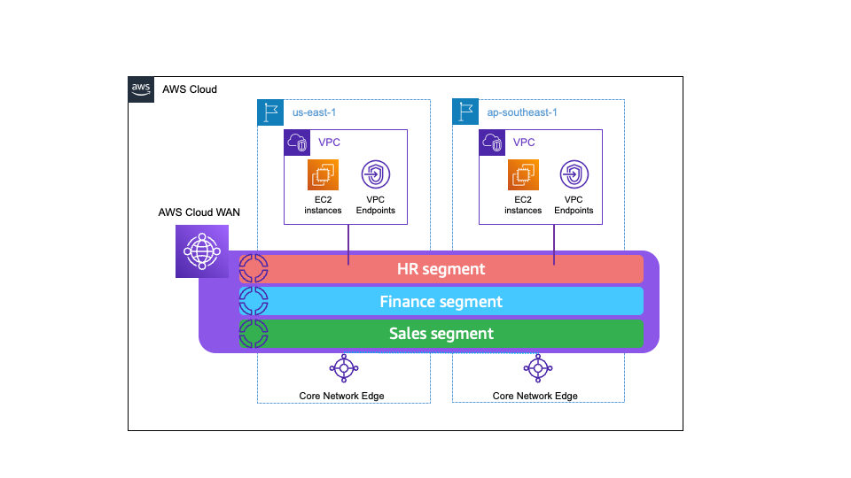
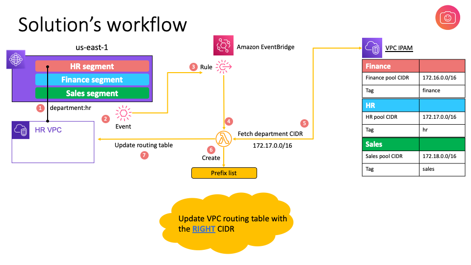

## AWS Cloud WAN and VPC IPAM integration for end-to-end automated routing

AWS Cloud WAN is a service that you can use to build, manage, and monitor a unified global network that connects resources running across your cloud and on-premises environments. Cloud WAN ensures dynamic route propagation across multiple regions, and you only need to update the routing tables of the VPCs to provide network connectivity for workloads that reside within the VPCs.

In this example, we'll see how to automatically push routes to VPC routing tables, and create a fully automated end-to-end routing architecture.

### Scenario and network topology

You have a global network, across 2 regions. Cloud WAN provides global network orchestration across these regions, and there are 3 Cloud WAN segments, one each for departments named Finance, Sales and HR. VPC IPAM stores the CIDRs assigned to each of the 3 departments.



Whenever a VPC's attachment to Cloud WAN is created, this solution detects the 'attachment created' event, and automatically pushes the department's summary route into the VPC's routing table.



## Prerequisites:

- An [AWS account](https://signin.aws.amazon.com/signin?redirect_uri=https%3A%2F%2Fportal.aws.amazon.com%2Fbilling%2Fsignup%2Fresume&client_id=signup&code_challenge_method=SHA-256&code_challenge=0HQWGyGWYR-1yDUXafaSt2wlhL8OZGAHfZx3sDZN4mE) that you are able to use for testing, that is not used for production or other purposes. NOTE: You will be billed for any applicable AWS resources used if you complete this lab that are not covered in the [AWS Free Tier](https://aws.amazon.com/free/?all-free-tier.sort-by=item.additionalFields.SortRank&all-free-tier.sort-order=asc&awsf.Free%20Tier%20Types=*all&awsf.Free%20Tier%20Categories=*all).

- To deploy this solution you will have to have the [AWS CLI](https://docs.aws.amazon.com/cli/latest/userguide/getting-started-install.html) installed.

- If on Windows you will need a utility to execute Makefiles 

## Step 1 - Deployment (Single command line deployment instructions)

This sample project is meant to be deployed to a single account and multiple regions. By default, AWS regions us-east-1, us-west-2 and ap-southeast-1 are in use.

1. Download the code and cd sample-ipam-cf directory. 

```bash
git clone https://github.com/labeveryday/sample-ipam-cf.git && cd sample-ipam-cf
```

2. Deploy the CloudFormation stacks.

```bash
make deploy
```

>NOTE: This deployment will take greater than 15 minutes.

## Step 2 - Testing and validation

After the VPC has been attached to Cloud WAN give the solution about 5-10 minutes before the routing tables have been updated. 

1. In us-east-1 open the [EC2 console](https://us-east-1.console.aws.amazon.com/ec2/home?region=us-east-1#Instances:instanceState=running) and connect to the `cloud-wan-demo-instance` ec2 instance with SSM. 
2. In ap-southeast-1 open the [EC2 console](https://ap-southeast-1.console.aws.amazon.com/ec2/home?region=ap-southeast-1#Instances:instanceState=running) and copy the private ip of the instance. 
3. In the ec2 SSM terminal window type `ping ` and then paste the private ip address of the instance in ap-southeast-1.

You now have global end-to-end routing in AWS!

>For additional verification you can check the default routing tables in the hr vpcs in both regions. You will notice a prefix list that was added when your VPC was attached to Cloud WAN.  

## Step 3 - Clean up

1. Delete CloudFormation stacks. This will remove all the stacks. (cloud wan, ipam, regional infrastructure, eventbridge rules, and Cloud WAN VPC attachments)

```bash
make undeploy
```

>NOTE: Remember to do `make undeploy` when you are done with the lab and your tests, to avoid undesired charges.

## Optional - Detailed instructions (Deploy a single stack at a time)

This section not needed if you deployed step 1. It is to deploy each stack individually. 

1. `make deploy-global-infra` - This will deploy Cloud WAN and IPAM in us-east-1. 
2. `make deploy-target-1` - This will deploy a VPC, private subnet, VPC endpoints for SSM, an EC2 instance, lambda function, eventbridge rule, and Cloud WAN attachment in us-east-1. 
3. `make deploy-target-2` - This will deploy a VPC, private subnet, VPC endpoints for SSM, an EC2 instance, lambda function, eventbridge rule, and Cloud WAN attachment in ap-southeast-1.

### Considerations
1. This solution is useful when your VPCs have multiple exit points. In the scenario drawing, each VPC has 2 exit points. One towards the Cloud WAN core-network, and second towards AWS Direct Connect gateway
2. In addition to the networking constructs, there's pricing associated with EventBridge and with Lambda. Please check out service pricing pages for more details

## References

- This solution was presented at re:Invent 2022 as a breakout session: [Demystifying VPC IP addressing & creating a complete routing solution](https://www.youtube.com/watch?v=rvJMCdjSZxU)
- [AWS Cloud WAN documentation.](https://docs.aws.amazon.com/network-manager/latest/cloudwan/what-is-cloudwan.html)
- [AWS Cloud WAN Workshop.](https://catalog.workshops.aws/cloudwan/en-US)
- Blog post: [Introducing AWS Cloud WAN (Preview).](https://aws.amazon.com/blogs/networking-and-content-delivery/introducing-aws-cloud-wan-preview/)
- Blog post: [AWS Cloud WAN and AWS Transit Gateway migration and interoperability patterns](https://aws.amazon.com/blogs/networking-and-content-delivery/aws-cloud-wan-and-aws-transit-gateway-migration-and-interoperability-patterns/)

Please reach out to aichadha@amazon.com or duanlig@amazon.com in case you have any questions about this repo.
